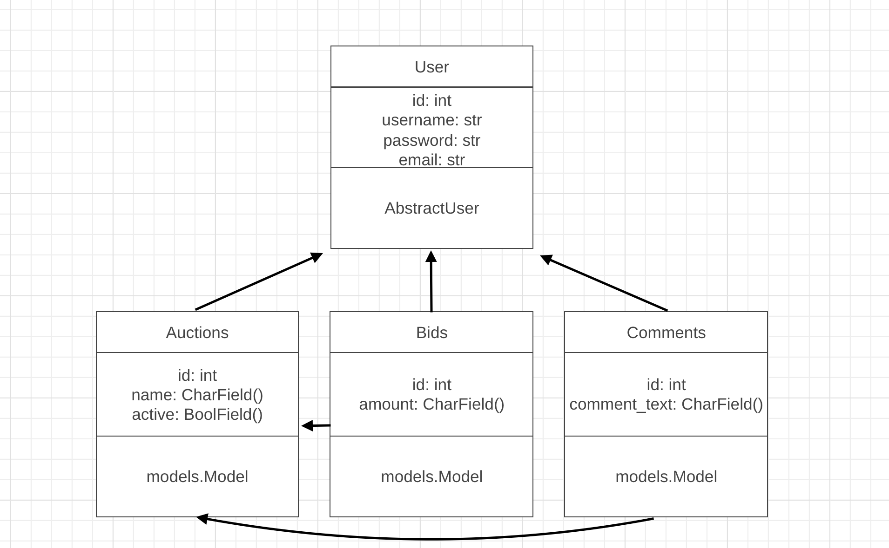

# Mise

This application is a replica of eBay where users can list certain items they want to cell. To buy a certain item, the user has to bid on that certain item. The user can also add a lisiting to a watchlist and comment on certain listings as well.

This program has been created as an assignment for the minor "Programmeren" at the University of Amsterdam.


## Getting Started

To run this program Python is required with the following libaries:
* Django 
    ```pip install Django```
* Markdown2
    ```pip install Markdown2```
* Django Bootsrap Form
    ```pip install django-bootstrap-form```

By running ```python3 manage.py runserver``` the application will be run and the website can be accessed.

## Design document

This program requires a couple of certain models and function in order to work properly.

### Models

This program requires three extra models, in addition to the User model, in order to work appropriatly. 
These models are:

* Auction Listing
Houses all the listings present, stored as a CharField, on the website and it needs to store if the listing is active or not with the use of a BooleanField. Which needs to have a many-to-many to the users model to determine, who has put the listing online.

* Bid Listing
Houses all the bids, stored as a DecimalField, per listing and who has been bid. This model will need two many-to-may links to the auction listing and the user list to link the bids to a certain auction and user.

* Comment Listing
Houses all the comments, stored as a CharFiels, per listing and user. This model will need two many-to-many links to the auction listing and the user list to link the comments to a certain auction and user.

This is a graph of how the models will look like in the program.


