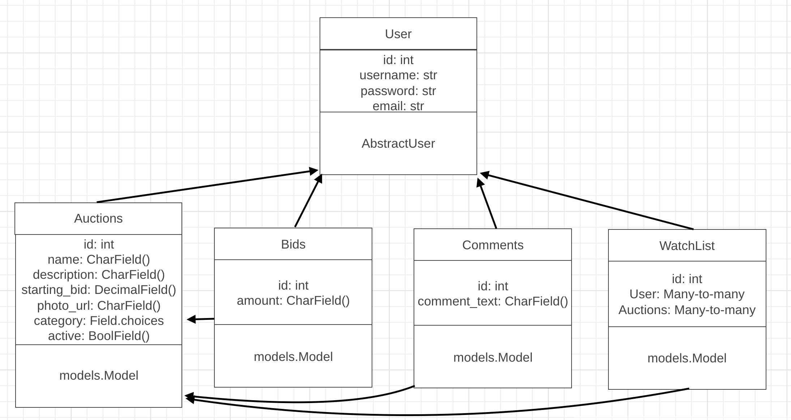
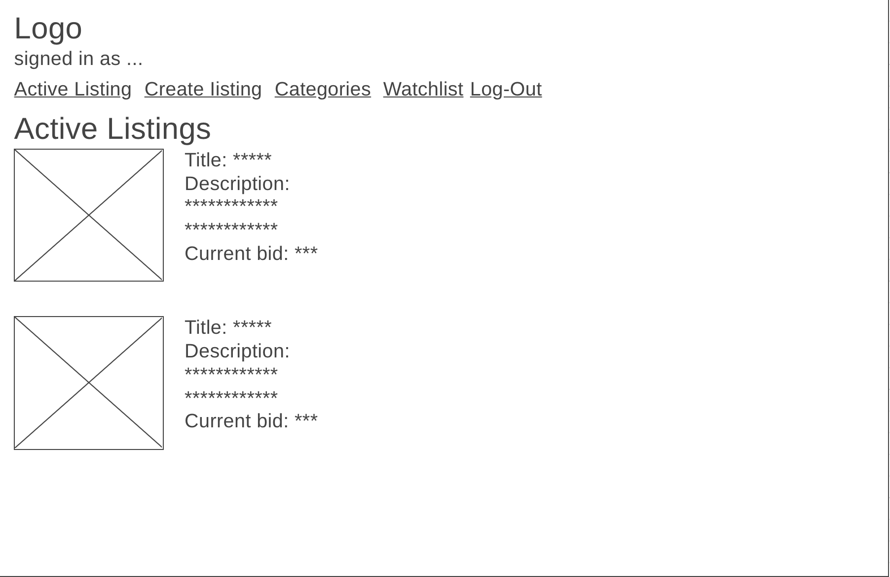
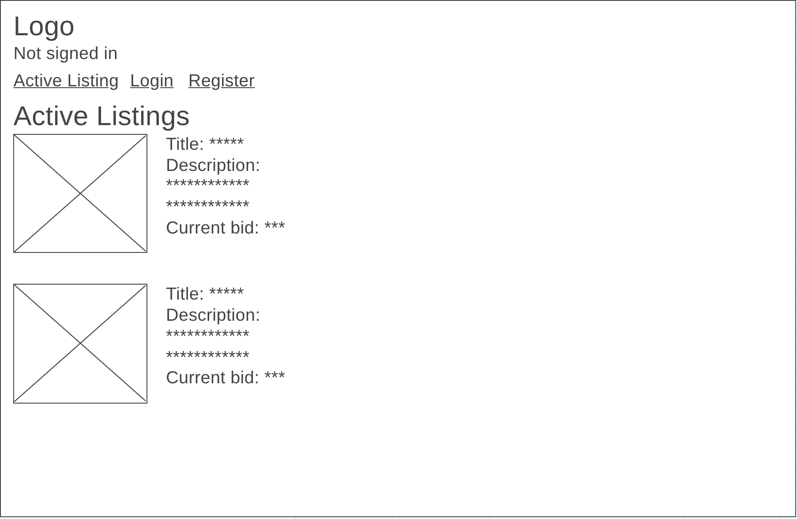
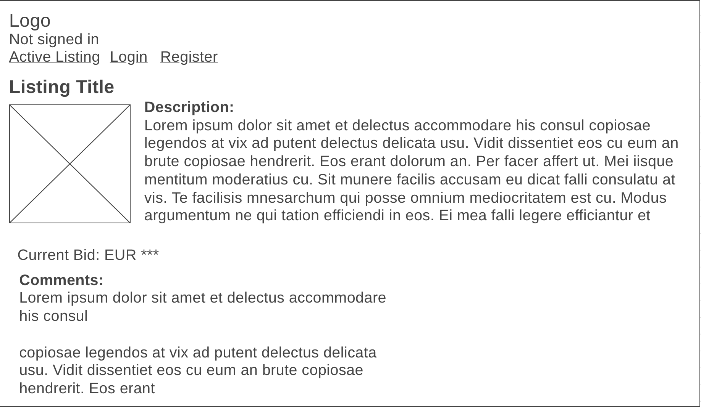
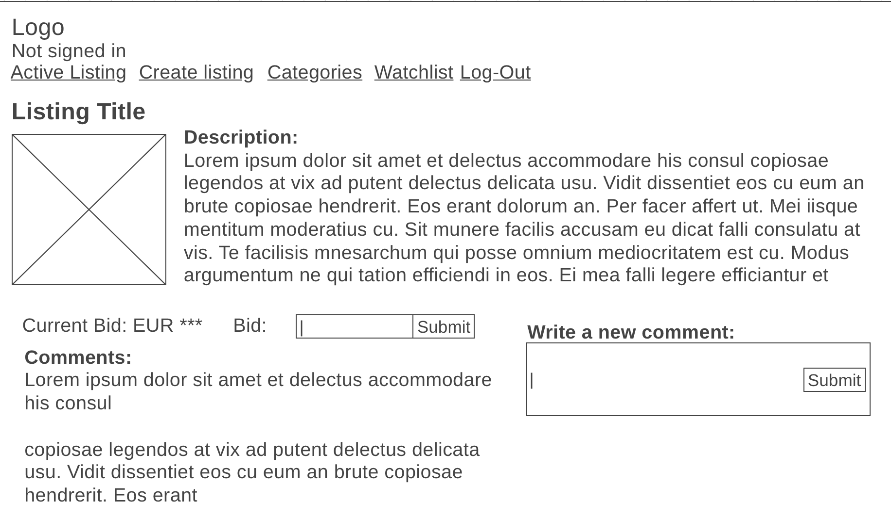
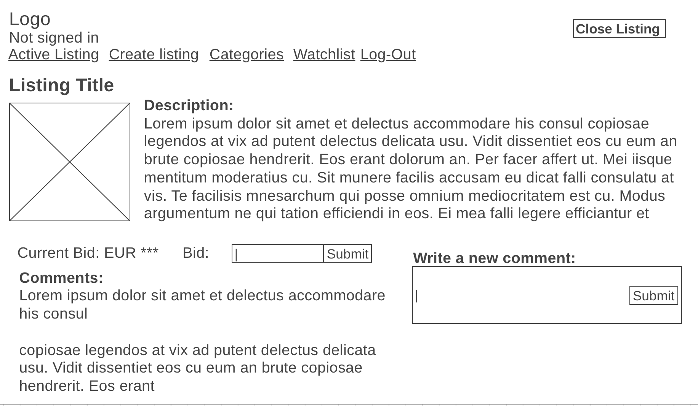
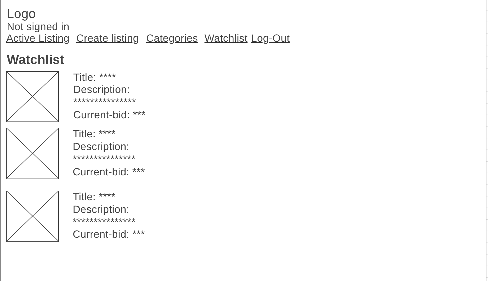
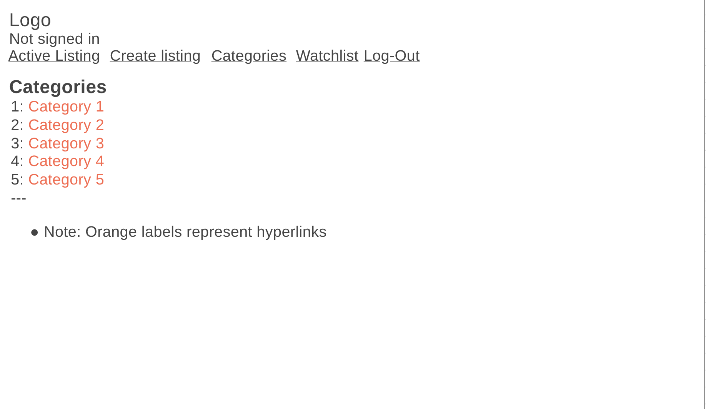

# Mise

This application is a replica of eBay where users can list certain items they want to cell. To buy a certain item, the user has to bid on that certain item. The user can also add a lisiting to a watchlist and comment on certain listings as well.

This program has been created as an assignment for the minor "Programmeren" at the University of Amsterdam.


## Getting Started

To run this program Python is required with the following libaries:
* Django 
    ```pip install Django```
* Markdown2
    ```pip install Markdown2```
* Django Bootsrap Form
    ```pip install django-bootstrap-form```

By running ```python3 manage.py runserver``` the application will be run and the website can be accessed.

## Design document

This program requires a couple of certain models and function in order to work properly.

### Models

This program requires three extra models, in addition to the User model, in order to work appropriatly. 
These models are:

* Auction Listing

Houses all the names, descriptions, a photo url, and startingbids of the listings present, stored as CharFields and a DecimalField, on the website. It also needs to store the catogories of the listing and if the listing is active or not, with the use of Field.choices and a BooleanField. Which needs to have a many-to-many to the users model to determine, who has put the listing online.

* Bid Listing

Houses all the bids, stored as a DecimalField, per listing and who has been bid. This model will need two many-to-may links to the auction listing and the user list to link the bids to a certain auction and user.

* Comment Listing

Houses all the comments, stored as a CharFiels, per listing and user. This model will need two many-to-many links to the auction listing and the user list to link the comments to a certain auction and user.

* WatchList Listing
This will combine the users with certain auctions that they have added to their watchlist. It uses two many-to-many links to the auction listing and the users.

This is a graph of how the models will look like in the program.


### Create Listing

Every user should be able to open a listing on the webspage. A new page will be needed to make that possible and this page could only be entered by a user who is signed in.

It needs to have a form with the following things:

* Title
* Description
* Starting Bid
* Image URL (optional)
* Category (optional)

An example of how the page will look like can be found below:


### Active Listing Page (Homepage)

The homepage will consist of all the listings that are currently active on the website.

It needs to have the following things per item:

* Photo (if added)
* Title
* Description
* Current price or current bid

An example of how the page will look like can be found below for logged in users and non-logged in users:

Logged-in

Logged-out

### Listing Page

Every listing should have its own page where the user can watch a listing in full detail. These pages vary a bit from users that are logged out , logged in and that have created the listing.

A logged out user should see:

* Only information like:
    * Photo
    * Title
    * Description
    * Current bids
    * Comments

* A logged in person can do/see things on top of that namely:
    * Place a new bid
    * Place listing in watchlist
    * Place a comment
    * See if he/she has won when listing is closed.

* A person who made the listing can also close the list from the page.

An example of those three scenarios can be found here:

Logged-out

Logged-in

Owned Listing

### Watchlist

This page should house all the listings that a user has saved to watch for later. Can only be accessable by users that have been logged in.

* It houses per entry:
    * Title
    * Description
    * Current bid
    * Photo

An example of the watchlist can be found here:


### Categories

This page houses every available category that a listing can be in. When clicked on set category, the user will be redirected to a page with the listings specifically for each category.

The page with all the listings is identical to the watchlist example. For an example on this, then take a look at the watchlist.

An example of the category list can be found here:


